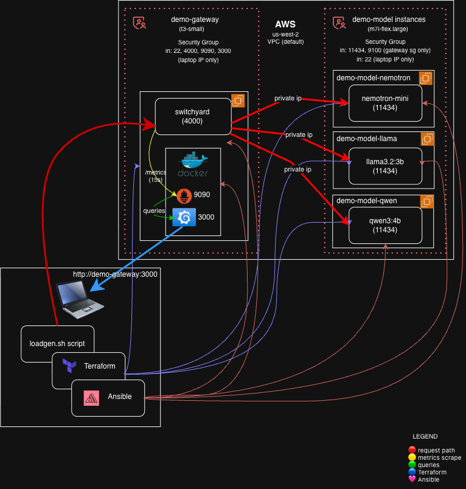
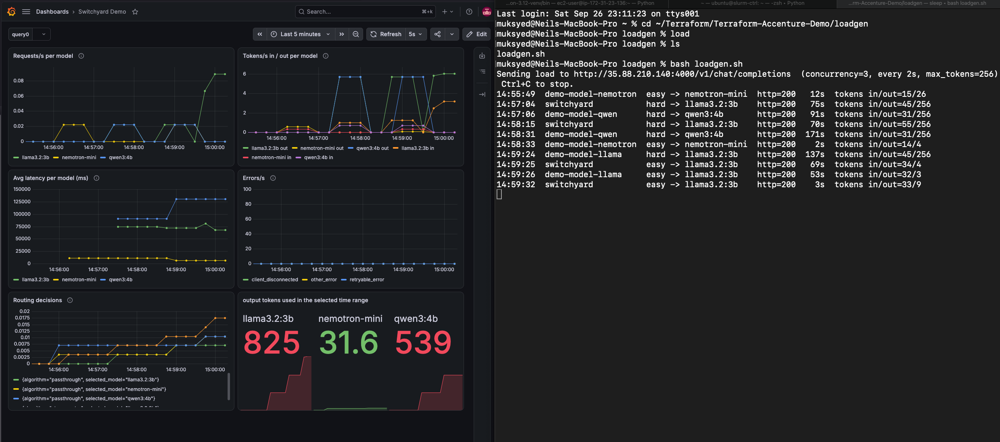

# Switchyard LLM Routing on AWS

An end-to-end proof of concept for **routing LLM requests across several open models**, built entirely as code.
[NVIDIA Switchyard](https://github.com/NVIDIA-NeMo/Switchyard) sits in front of three open-source models
(**NVIDIA Nemotron**, **Llama 3.2**, **Qwen3**) served by [Ollama](https://ollama.com) on AWS EC2.
Every request is measured in **Prometheus** and visualised in **Grafana**.

Infrastructure is provisioned with **Terraform**; every server is configured with **Ansible**.



---

## What it shows

## Screenshots


### Demo: load generator + live Grafana dashboard
https://github.com/user-attachments/assets/c84605bc-b247-43ad-9817-682b50deb9bc

- **LLM request routing.** Clients call one OpenAI-compatible endpoint. Switchyard either lets its router
  choose the model (`auto` route) or sends the request to a specific model (`passthrough` routes).
- **Infrastructure as code, end to end.** One `terraform apply` and one `ansible-playbook` rebuild the whole stack
  from nothing; `terraform destroy` removes it.
- **One source of truth.** A single model map in Terraform drives the EC2 instance tags, the generated
  Ansible inventory, and Switchyard's routing configuration.
- **Least-privilege security.** Model endpoints are reachable only from the gateway's security group over private
  IPs; admin ports are open only to the operator's (auto-detected) IP.
- **Observability.** Per-model requests, token throughput, latency, errors, and routing decisions.

## Components

| Host | Instance type | Runs |
|---|---|---|
| `demo-gateway` | t3.small | Switchyard (`:4000`), Prometheus (`:9090`) and Grafana (`:3000`) in Docker Compose |
| `demo-model-nemotron` | m7i-flex.large | Ollama (`:11434`) + `nemotron-mini` |
| `demo-model-llama` | m7i-flex.large | Ollama (`:11434`) + `llama3.2:3b` |
| `demo-model-qwen` | m7i-flex.large | Ollama (`:11434`) + `qwen3:4b` |

Ubuntu 24.04 (latest Canonical AMI, looked up by owner ID), default VPC, `us-west-2`. CPU only, no GPUs.

## How a request flows

1. A client (here `loadgen/loadgen.sh`) sends an OpenAI-style chat request to Switchyard on the gateway, with
   `"model"` set to a **route** name: `switchyard` (auto) or `demo-model-llama` / `-nemotron` / `-qwen`.
2. Switchyard picks a target and forwards the request to that node's **private IP** on port 11434 (`/v1`).
3. Ollama generates the answer; Switchyard returns it and records metrics (requests, tokens, latency, routing decision).
4. Prometheus scrapes Switchyard's `/metrics` every 15 s; Grafana queries Prometheus.

## Security design

| Security group | Inbound | From |
|---|---|---|
| Gateway | 22, 3000, 4000, 9090 | operator's IP only (looked up at apply time) |
| Model nodes | 11434 (Ollama), 9100 (reserved for node_exporter) | **gateway security group only** |
| Model nodes | 22 | operator's IP only |
| Egress (all instances) | all outbound | needed for packages and model downloads |

Other choices: an IAM user limited to EC2, a dedicated ed25519 SSH key, SSH host keys accepted only on first
connection (`StrictHostKeyChecking=accept-new`), services running as dedicated non-login system users, and
config files owned by root.

## Repository layout

```
terraform/   provider + pinned versions, AMI/VPC/IP lookups, key pair, security groups,
             instances (for_each over the model map), outputs, Ansible inventory template
ansible/     site.yml + roles:
               swap        swap file on every host
               ollama      Ollama service + model pull (one role, per-host model from the inventory)
               switchyard  binary, templated routes.toml (validated before install), systemd unit
               monitoring  Docker, Prometheus, Grafana (data source provisioned as code), dashboard JSON
loadgen/     loadgen.sh: mixed easy/hard prompts across all routes
docs/        architecture diagram (draw.io + PNG)
```

## Running it

### Prerequisites

- Terraform, Ansible (with the `ansible.posix` collection), AWS CLI, `jq`
- An AWS CLI profile named `accenture-demo` (set in `terraform/versions.tf`) with EC2 permissions
- An SSH key pair at `~/.ssh/accenture_demo` / `~/.ssh/accenture_demo.pub` (`ssh-keygen -t ed25519 -f ~/.ssh/accenture_demo`)
- The Switchyard server binary at `ansible/roles/switchyard/files/switchyard-server`. It is not in Git (26 MB);
  see [`ansible/roles/switchyard/README.md`](ansible/roles/switchyard/README.md) for how to build it once.

### Build

```bash
cd terraform
terraform init
terraform plan -out=tfplan        # review: 17 resources
terraform apply tfplan            # writes ../ansible/inventory.ini

cd ../ansible
ansible all -i inventory.ini -m ping
ansible-playbook -i inventory.ini site.yml     # model downloads take ~10-15 min
```

Tags let you re-run parts: `--tags model_roles`, `--tags switchyard`, `--tags monitoring`.

### Use

```bash
terraform -chdir=terraform output              # gateway IP and URLs

curl http://<gateway-ip>:4000/v1/models        # lists the routes
curl http://<gateway-ip>:4000/v1/chat/completions -H "Content-Type: application/json" \
  -d '{"model":"switchyard","messages":[{"role":"user","content":"Explain DevOps in one sentence"}]}'

./loadgen/loadgen.sh                           # continuous mixed load; Ctrl+C to stop
```

Grafana: `http://<gateway-ip>:3000`. Import the dashboard from
`ansible/roles/monitoring/files/dashboards/` (Dashboards → New → Import).

### Tear down

```bash
cd terraform && terraform destroy && terraform state list    # should print nothing
```

Public IPs change after every stop/start or rebuild; re-run `terraform apply` to refresh the inventory and
the operator-IP security rules.

## What the measurements showed

- **The `auto` route kept plain chat on the efficient model.** Switchyard's stage router scores tool-calling signals
  in agent conversations; one-off chat prompts carry none, so even hard prompts went to `llama3.2:3b`.
  An `llm_classifier` route (a judge model classifies difficulty first) would suit chat-only traffic.
- **CPU inference is slow, and queueing dominates.** A 256-token answer took ~70 s on 2 vCPUs (~3-4 tokens/s).
  Short answers sometimes took the same time because they waited behind a long one on the same node
  (head-of-line blocking).
- **Reasoning models cost more on easy work.** `qwen3:4b` used ~190 "thinking" tokens to answer "hello", and an
  easy prompt hit the 256-token cap in 164 s. This is the case for routing easy requests to smaller models.

## Next steps

- node_exporter on every host (port 9100 is already allowed from the gateway) to correlate latency with CPU saturation
- Provision the Grafana dashboard automatically, like the data source
- Try `llm_classifier` routing for chat traffic, and a `random` route across replicas for load spreading
- Download the Switchyard binary from an artifact store (built by CI) instead of copying it from the operator's machine
- GPU instances for production-grade latency

## Cost

Everything is torn down with `terraform destroy` after each session. Running all four instances costs roughly
$0.30/hour plus EBS storage and public IPv4 addresses (us-west-2 on-demand pricing).
